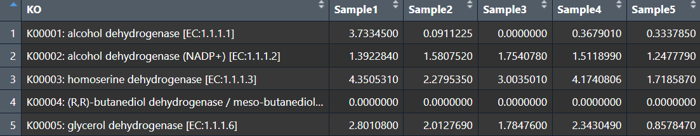
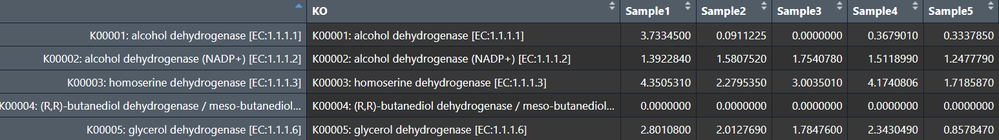
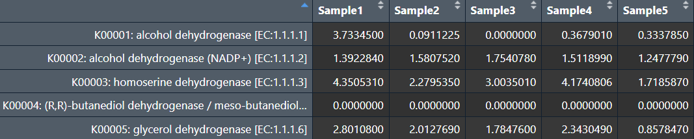
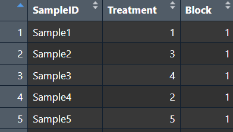
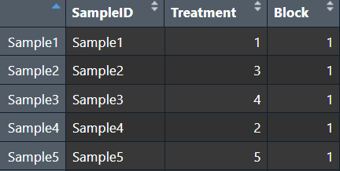
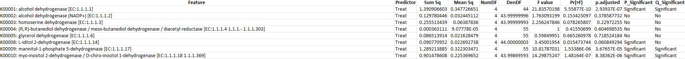
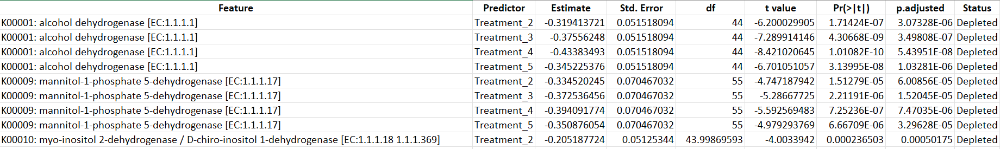
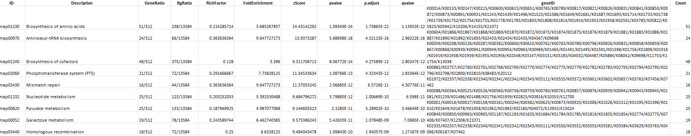
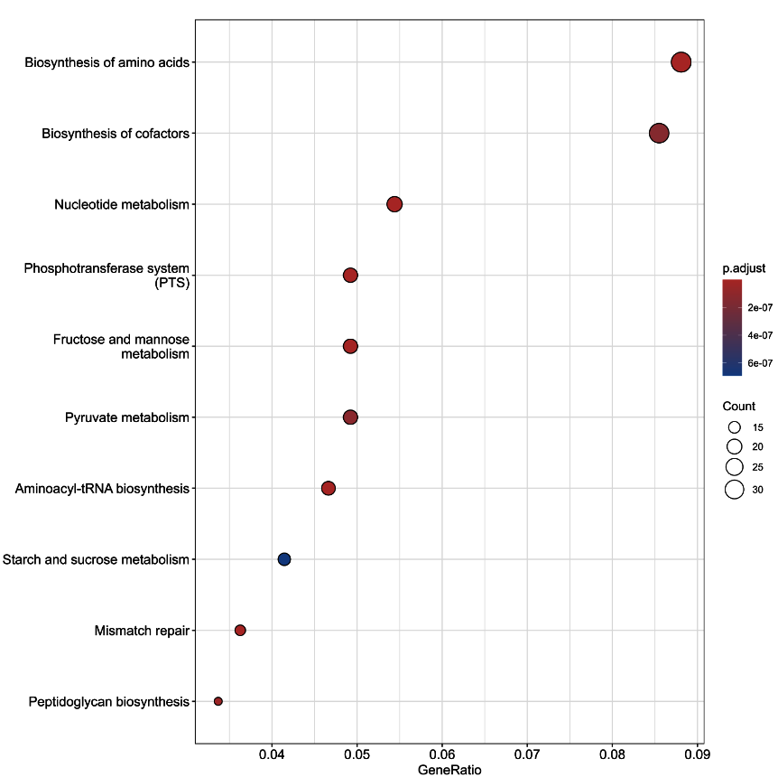

# Genomica: The R Package for Differential Analysis and Functional Enrichment


## Welcome to Genomica (V2.0.1)

**Genomica** is an R package for analysing ortholog abundance data using linear mixed models followed by functional enrichment, delivering **differential results** and **pathway-level insights** in a single streamlined workflow.

Genomica takes a feature abundance table and sample metadata as input, and returns **differential abundance results** with **pathway-level insights** (functional enrichment) - highlighting the biological processes driving observed changes, all in clear, ready-to-use formats.

Genomica is compatible with outputs from common pipelines (e.g., KO tables from HUMAnN), and while it is specifically designed for ortholog data, it can be applied to any feature table.
Even with non-ortholog inputs (e.g., AMR or taxonomy tables), Genomica provides robust differential analysis to identify features that significantly change across conditions.

**Designed for metagenomics and functional profiling studies, Genomica enables you to:**
* Identify significantly changing features across conditions.
* Model **complex experimental designs** (e.g., repeated measures, random effects).
* Move directly from statistical results to biological interpretation.

#### If you use Genomica, please cite using:

Galgano, S. Genomica: linear mixed model based, multiple hypothesis testing corrected, ortholog functional enrichment analysis. BMC Bioinformatics (2026). https://doi.org/10.1186/s12859-026-06450-y

Yu G, Chen M (2024). MicrobiomeProfiler: An R/shiny package for microbiome functional enrichment analysis. R package version 1.12.0, https://yulab-smu.top/contribution-knowledge-mining/, https://github.com/YuLab-SMU/MicrobiomeProfiler/.

#### The theory and methodology are fully explained in the paper (https://doi.org/10.1186/s12859-026-06450-y) - if you want to start using Genomica right away, follow the tutorial below.


## Installation

This will install both MicrobiomeProfiler (Yu G., Chen M, 2024), required for the functional enrichment and Genomica:

```{r}
if (!require("BiocManager", quietly = TRUE))
    install.packages("BiocManager")

BiocManager::install("MicrobiomeProfiler")

install.packages("devtools")

devtools::install_github('sgalg/Genomica')
```

## Analysis


The input files for Genomica are two data frames (i.e., Data and Metadata).

The following tutorial shows how to prepare the data frames and how to carry out the analyses, based on the pre-loaded demo data frames:
* **Data_Demo**: 500 cpm-normalised KOs across 35 samples.
* **Metadata_Demo**: information on the study layout, i.e. treatment and random factor allocation relative.

To call these data frames simply load the package via using:

```{r}
library(Genomica)
```
and then you can store the demo data frames into variables, by typing, for example:
```{r}
Data<-Data_Demo
Metadata<-Metadata_Demo
```

### Data

#### IMPORTANT, the data frame "Data" must be formatted with features as rows and samples as columns, however, currently we can see that the list of features (KOs) is embedded within the first column:


```{r}
print(Data[1:5,1:5])
```



The format of Data_Demo (shown above) is typical of most bioinformatic pipelines.

1. To proceed with the analysis with Genomica, we need to assign the feature names as row names:

```{r}
rownames(Data)<-Data$KO
print(Data[1:5,1:5])
```


2. Now we can delete the feature-embedded column:

```{r}
Data<-Data[,-1]
print(Data[1:5,1:5])
```


**Data is now ready**

#### IMPORTANT: Please delete the rows containing the abundance of UNMAPPED and UNGROUPED KOs, as these would interfere with the enrichment.


### Metadata
Your metadata must be formatted with samples as rows and features as columns (opposite to what seen for Data).
#### IMPORTANT: the sample names must be assigned as rows (row names):
#### IMPORTANT: Please delete the character "/" in any of your predictor levels (e.g., if one of your treatments is "A/Skin" you can transform it to "ASkin").  The character "/" in the predictor levels leads to an error that stops Genomica from working correctly.

```{r}
print(Metadata[1:5,])
```

```{r}
rownames(Metadata)<-Metadata$SampleID
print(Metadata[1:5,])
```


## Performing an analysis with Genomica

#### IMPORTANT, the features with abundance = 0 across all samples will be exluded from the analysis.

Currently, Genomica allows one or with two predictors (fixed effects). In the latter case, the interaction between the fixed effects (Predictor 1 * Predictor 2) will be tested.

Use the below to perform the analysis:
```{r}
genomica(Data = Data, Metadata = Metadata,
         Predictors = c('Treatment'),P1_Levels = c('1','2','3','4','5'),
         R_Effects = c('Block'),R1_Levels = c('1','2','3','4','5','6','7'),
         Log10_Transf = TRUE,Folder_Name = c('Test'),
         FDR_Level=0.05,ImgRes=300)
```

1. In this particular case, metadata only contains one predictor (Treatment), whose levels (i.e., different treatment groups) are Treatment 1 to 5, with Treatment 1 being the control group (i.e., Treatment 1 is the first element in the vector P1_Levels).

#### IMPORTANT: if your predictor is a numerical variable, you can ignore P1_Levels or P2_Levels (Default: P1_Levels=c(0)).

#### IMPORTANT: if you had two predictors, you could add these in the “Predictors” vector (e.g., Predictors=c(‘Treatment’, ‘Phase’)), and specify the levels for the second predictor in P2_Levels (e.g., P2_Levels=c(‘Starter’, ‘Grower’, ‘Finisher’)).

2. The random factor in this metadata is "Block" (the study in this case was a randomised block design with 7 blocks).

3. Log10_Transf = TRUE; this will tell Genomica to Log10(+1) trasnform Data (i.e., please look at the model diagnosis to assess whether transformation is appropriate for your data).
4. Folder_Name = c('Test'); this will just assign a name for the result folder.
5. FDR_Level=0.05; this set the significance level (Default P adjusted < 0.05).
6. ImgRes=300; this is the dpi resolution of your output figures.

## Results

The results for the analysis are all organised in the the "Genomica_Output" directory:
* Genomica_Output
  * Combined_All_Features (This file, saved both as .txt and .xslx summarises the LMM results for all the feature in Data)
  
  * Significant_Comparison (This file, saved both as .txt and .xslx summarises the significant comparisons, via also including a pair-wise analysis for all the levels in the predictor)
  
  * Enrichment (This directory will store the results of the enrichment analysis)
    * Enriched (Directory storing the enrichment analysis results for the enriched orhtologs)
      * Predictor 1 (Genomica will create a folder for each predictor)
        * Cumulative_Vs_Control_Enriched (This file, saved both as .txt and .xslx summarises the p.adjusted enriched functions across the orthologs), e.g.:
        
        * If more than five functions are found after the enrichment analysis, a publication-ready 1,200 dpi tree.tiff figure will be generated, e.g.:
        
        * P_1 Level 1 to n (a directory will be created for every predictor level, in which the p.adjusted enriched functions are stored together with a publication-ready 1,200 dpi dot plot.tiff file), e.g.:
        
    * Depleted (Directory storing the enrichment analysis results for the depleted orhtologs)
      * Predictor 1 (Genomica will create a folder for each predictor)
        * Cumulative_Vs_Control_Enriched (This file, saved both as .txt and .xslx summarises the p.adjusted enriched functions across the orthologs), e.g.:
        
        * If more than five functions are found after the enrichment analysis, a publication-ready 1,200 dpi tree.tiff figure will be generated, e.g.:
        
        * P_1 Level 1 to n (a directory will be created for every predictor level, in which the p.adjusted enriched functions are stored together with a publication-ready 1,200 dpi dot plot.tiff file), e.g.:
        

#### IMPORTANT: if no significant functions are found after the enrichement analysis, the files for the different comparisons will be empyt and the .tiff figures are not generated.


## References

Bates, D., Mächler, M., Bolker, B., & Walker, S. (2015). Fitting Linear Mixed-Effects Models Using lme4. Journal of Statistical Software, 67(1), 1–48. https://doi.org/10.18637/jss.v067.i01

Kuznetsova, A., Brockhoff, P. B., & Christensen, R. H. B. (2017). lmerTest Package: Tests in Linear Mixed Effects Models. Journal of Statistical Software, 82(13), 1–26. https://doi.org/10.18637/jss.v082.i13

Barbosa, A.M. (2015), fuzzySim: applying fuzzy logic to binary similarity indices in ecology. Methods Ecol Evol, 6: 853-858. https://doi.org/10.1111/2041-210X.12372

Yu G, Chen M (2024). MicrobiomeProfiler: An R/shiny package for microbiome functional enrichment analysis. R package version 1.12.0, https://yulab-smu.top/contribution-knowledge-mining/, https://github.com/YuLab-SMU/MicrobiomeProfiler/.

Yu G (2025). enrichplot: Visualization of Functional Enrichment Result.
doi:10.18129/B9.bioc.enrichplot <https://doi.org/10.18129/B9.bioc.enrichplot>, R package

Xu, S., Hu, E., Cai, Y. et al. Using clusterProfiler to characterize multiomics data. Nat Protoc 19, 3292–3320 (2024). https://doi.org/10.1038/s41596-024-01020-z

Yu G, Wang LG, Han Y, He QY. clusterProfiler: an R package for comparing biological themes among gene clusters. OMICS. 2012 May;16(5):284-7. doi: 10.1089/omi.2011.0118. Epub 2012 Mar 28. PMID: 22455463; PMCID: PMC3339379.


